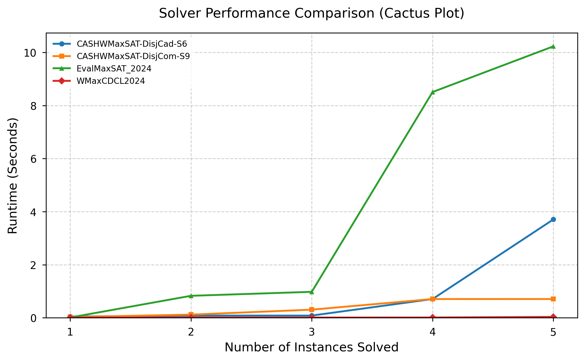

# maxsat-evaluation-2024

Local and Slurm execution scripts for running and benchmarking MaxSAT Evaluation 2024 weighted solvers.

---

## ⚡ Quick Start (TL;DR)

### 1. Environment Setup

Activate your environment and install the core dependencies in editable mode:

```bash
conda activate mse24env
pip install -e .
```

### 2. Configure the Execution Matrix

Edit `config.yaml` to set your paths, timeouts, and solvers.

### 3. Run Locally

Execute across multiple local CPU threads:

```bash
python3 run_eval.py
```

### 4. Run on HPC Cluster (Slurm)

Update `#SBATCH --array=0-2283%50` in `submit_eval.sbatch` to match your exact $(\text{Solvers} \times \text{Benchmarks}) - 1$ grid size. Then submit:

```bash
# important: do not forget to update `#SBATCH --array=0-2283%50`
sbatch submit_eval.sbatch
```

### 5. Generate Analysis Plots

Pass the timestamped output file to generate a standardized performance cactus plot:

```bash
python3 generate_plots.py results/eval_20260515_213055/evaluation_results.csv
```

---

## 🛠️ Configuration (`config.yaml`)

The `config.yaml` acts as the single source of truth for the framework. The pipeline parses this file to automatically calculate the flat 1D execution space across nodes.

```yaml
# global evaluation settings
timeout_seconds: 7200
max_workers: 4 # number of parallel instances for local running
result_dir: "./results"

# absolute or relative paths to benchmark directories
benchmark_dirs:
  - "./benchmarks-mse24/single-test-instance"
  - "./benchmarks-mse24/sample-test-instances"

# dictioanry of solvers to evaluate
# format: ShortName: "path/to/starexec/run/script"
solvers:
  WMaxCDCL2024: "./solvers/WMaxCDCL2024/bin/wmaxcdcl-openwbo"
  CASHWMaxSAT-DisjCad-S6: "./solvers/CASHWMaxSAT-DisjCad-S6/bin/starexec_run_default"
  CASHWMaxSAT-DisjCom-S9: "./solvers/CASHWMaxSAT-DisjCom-S9/bin/starexec_run_default"
  EvalMaxSAT_2024: "./solvers/EvalMaxSAT_2024/bin/starexec_run_EvalMaxSAT"
  # you can append future solvers easily
```

### Adding Solvers

You can add any solver binary or execution wrapper script to the matrix. Simply place the solver files in the workspace, ensure they have execution permissions (`chmod +x`), and map them inside the configuration.

---

## 📦 Data & Custom Benchmarks

- **Included Subset:** This repository contains only a small sample subset of instances for verification and testing.
- **Full MSE24 Suite:** To replicate the complete MaxSAT Evaluation 2024 tracking, download the official uncompressed or XZ-compressed datasets directly from the [MaxSAT Evaluation 2024 Website](https://maxsat-evaluations.github.io/2024/index.html).
- **Custom Datasets:** You can evaluate your own datasets by dropping `.wcnf` or `.wcnf.xz` benchmark folders anywhere into the workspace and adding their relative path to the configuration file.

---

## 📊 Performance Visualization

The plotting pipeline converts atomic metrics into publication-ready figures. The cumulative cactus plot sorts resolved instances along the x-axis against execution times on the y-axis.

### Execution Output

Graphs are saved automatically next to your selected data source path:  
`results/eval_TIMESTAMP/cactus_plot.png`

### Sample Output Reference

<p align="center">
  
</p>

## 📝 License & Permissions

- **Framework Wrapper:** The core scheduling runner, orchestration logic, data parsing layer, and plotting utilities are distributed under the MIT License.
- **Solvers:** Binary engines and their underlying code variants situated inside the `solvers/` subdirectory are owned by their respective competition authors and carry their own unique academic or open-source licenses (e.g., **GPL/MIT/Custom Open-Source**). Check individual solver source repositories for specific licensing compliance text.
